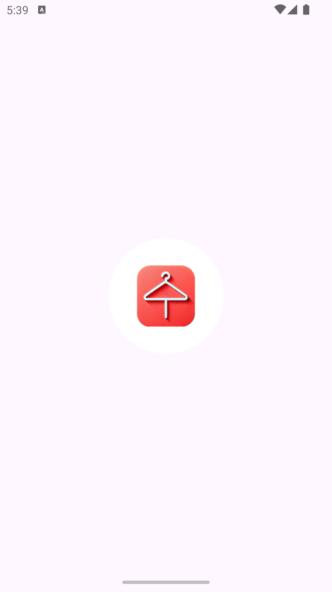

# 👕 Driply - Fashion & Rewards App

  

Driply is an Android app that allows users to **upload fashion posts, earn points, redeem rewards**, and stay updated with notifications. Built using **Java, Firebase, Retrofit, and Material UI**, Driply provides an engaging social experience for fashion enthusiasts.

---

## ✨ **Features**
✔️ **User Authentication** (Email & Phone)  
✔️ **Upload Fashion Posts** with images and descriptions  
✔️ **Earn Drips (points) & Redeem Rewards**  
✔️ **Push Notifications** for updates & interactions  
✔️ **Leaderboard** showcasing top users  
✔️ **Profile & Settings** (Edit profile, upload pictures)  
✔️ **Dark Mode Support** (if implemented)  

---

## 📸 **Screenshots**
| Home Screen  | Upload Post  | Leaderboard | Settings |
|---|---|---|---|
|  |  |  |  |

---

## 🛠 **Tech Stack**
- **Language:** Java (Android SDK)
- **UI:** XML, Material Design Components
- **Backend:** Firebase Authentication & Realtime Database
- **Networking:** Retrofit (API Calls)
- **Storage:** Firebase Storage
- **Push Notifications:** Firebase Cloud Messaging (FCM)
- **Image Loading:** Glide

---
